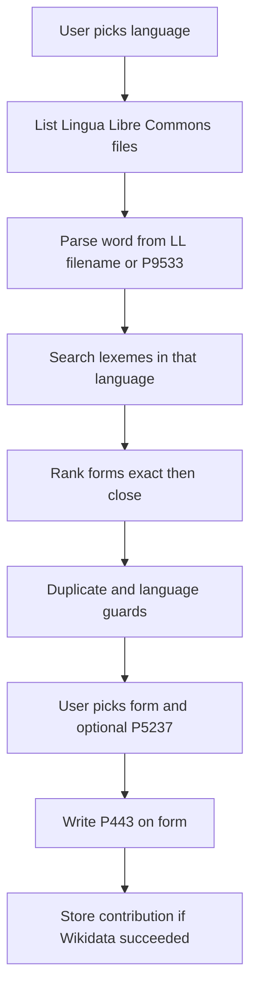

# WDAudioLex Backend Plan

Match Wikimedia Commons (Lingua Libre) pronunciation files to the correct
Wikidata lexeme **form**, write **P443** only when it is a real new
pronunciation, and refuse duplicates or language mismatches.

The service follows the [agpb-api](https://github.com/) Flask-RESTful layout:
`app.py`, `common.py`, `service/` resources, JWT OAuth, Swagger, SQLAlchemy.

The React frontend is a separate app. This repo is JSON + Swagger only.

## Product rules

- **Language-first.** The user picks a language. The backend maps
  `ig` / `ibo` / `Q33578` with `langcodes` to
  `Category:Lingua Libre pronunciation-{iso3}`.
- **Filename pattern.** `LL-Q{qid} ({iso})-{speaker}-{word}.{ext}`.
  Commons SDC `P9533` (transcription) is a fallback when the name is messy.
- **Match in that language only.** Search Wikidata lexemes for the extracted
  word; return **forms**, not just lemmas. Rank exact lemma/form, then close
  matches. Never cross-language.
- **Write P443 on a form** (`L123-F1`), never the lexeme. Optional **P5237**
  (pronunciation variety) is a qualifier. Optional **P407** (language of work)
  may be added the same way.
- **Wikidata first.** Edit with the user's MediaWiki OAuth token. Insert a
  local contribution row only if the edit succeeds.
- **Paginate Commons.** Do not load a whole language category (French is ~430k files).

### Guards on add

- Same Commons filename already on that form as P443 → reject
- File language QID ≠ lexeme language → reject
- Exact filename already in the local contributions table → reject (replay)
- Form already has some other P443 → allow, but flag `already_has_audio`

## Architecture

```
wdaudiolex-be/
  app.py
  common.py
  create_db.py
  service/
    __init__.py          # Flask, CORS, SQLAlchemy, Api(prefix), Swagger UI
    models.py
    require_token.py
    resources/           # Flask-RESTful Resource classes
    utils/
  swagger/config.json
  postman/
  tests/
```

Local database: SQLite. Toolforge: MariaDB via `SQLALCHEMY_DATABASE_URI`.



## API

Prefix `/api` from env. User-Agent on every Wikimedia request.

| Method | Path | Auth | Role |
|---|---|---|---|
| GET | `/health` | no | Liveness |
| GET | `/auth/login` | no | OAuth redirect + request token |
| POST | `/oauth-callback` | no | JWT |
| POST | `/auth/logout` | yes | Invalidate token |
| GET | `/languages` | no | Localized `iso`, `iso3`, `qid`, `commons_category` |
| GET | `/languages/<lang_code>` | no | Resolve `ig`, `ibo`, or `Q33578` |
| GET | `/commons/files` | no | Paginated LL files + parsed word + audio URL |
| GET | `/file/url/<titles>` | no | Playable Commons URL |
| POST | `/match-lexemes` | no | Ranked form candidates |
| POST | `/lexeme/audio/add` | **yes** | P443 on form, optional P5237, then local row |
| GET | `/contributions` | optional | History by user/language |
| GET | `/stats/me` | yes | Personal counts |
| GET | `/stats/leaderboard` | no | Top contributors |
| POST | `/skips` | yes | Hide a file for this user |
| GET | `/varieties` | no | Suggested P5237 items |
| GET/PATCH | `/users/<id>` | yes | `pref_langs` |

See [swagger/config.json](../swagger/config.json) and
[postman/WDAudioLex-BE.postman_collection.json](../postman/WDAudioLex-BE.postman_collection.json).

## Models

```text
users          id, username, pref_langs, temp_token
contributions  id, wd_item, form_id, username, lang_code,
               audio_filename, variety_qid, edit_type, data,
               revision_id, date
```

`edit_type` for this tool: `pronunciation_audio`.

## Auth

MediaWiki OAuth (`mwoauth`) → JWT containing `temp_token` + OAuth access
token → `Authorization: Bearer`. Consumer is **Wikidata** so `wbcreateclaim`
works. Commons file reads stay anonymous.

Password `clientlogin` is out of scope.

## i18n (backend contract)

- Accept `ui_lang` or `Accept-Language` on read endpoints.
- Resolve codes with `langcodes` (and `language-data`), not a static ISO-1 list.
  Commons / Lingua Libre categories use **ISO 639-3** (`ibo`). Wikidata lexeme
  search uses **ISO 639-1** when it exists (`ig`). `from_iso3()` converts
  639-3 → name, localized label, and 639-1. `wikidata_lang_code()` is what
  matching sends to Wikidata. Languages with no 639-1 (e.g. `dag`) stay on 639-3.
- Wikidata labels: `wikibase:language "{ui_lang},en"`.
- Error `message` keys stay English in v1. React owns UI chrome.

## Engagement extras (after core)

- Needs-audio filter, skip queue, match confidence (`exact` / `close`)
- Audio URL on every file/match
- Variety suggestions, personal stats, opt-in leaderboard, recent activity
- Session progress counts on add/skip responses

Out of v1: batch write, password login, uploading new Commons files.

## Constraints

- Python 3.12 or newer; Flask 3.1 / SQLAlchemy 2.0 (see `requirements.txt`)
- Send a User-Agent on every Wikimedia request (Toolforge policy)
- Paginate Commons; never load a whole language category
